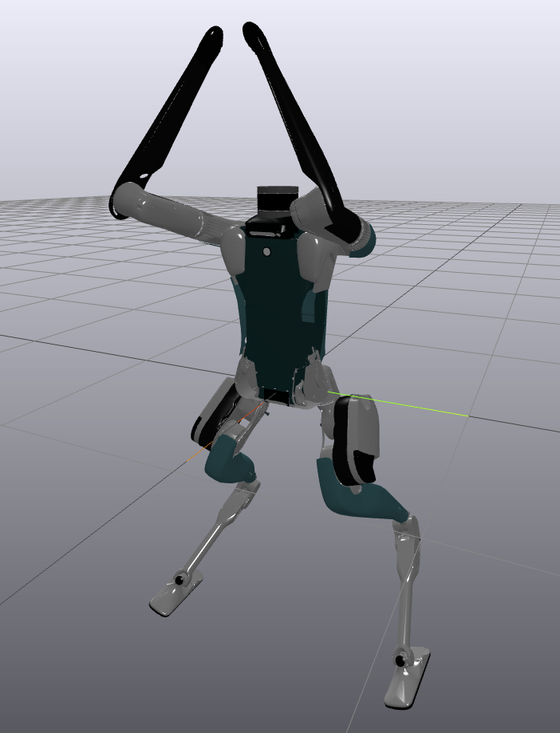
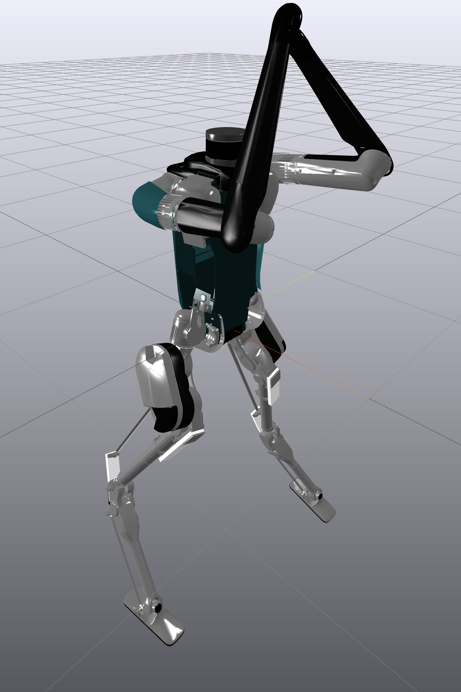
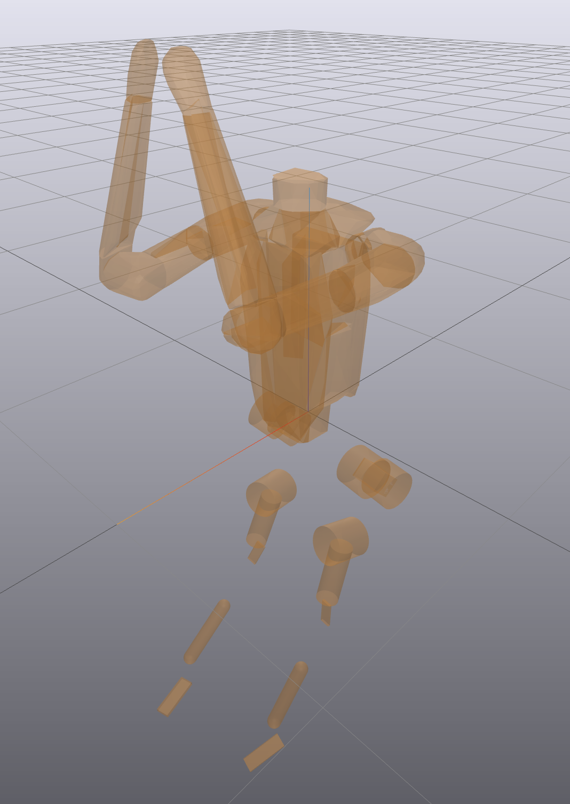

# SDF Model File for Digit V3 from Agility Robotics

<p align="center">
  
</p>

#

This package hosts SDF model files for the digit-v3 robot, along with its associated visual meshes and collision models. 

The model files are split between drake specific SDF and regular SDF versions. The regular SDF files loads a digit model without any closed loop links for the legs. The drake-oriented version of the model represents closed loops using the drake [LinearBushingRollPitchYaw](https://drake.mit.edu/doxygen_cxx/classdrake_1_1multibody_1_1_linear_bushing_roll_pitch_yaw.html) model element. This solution is a penalty method that approximates the closed loop kinematic relationship by connecting links with a spring, since Drake does not yet have full support for topological loops. The passive (no actuation commanded) closed loop model has been tested to load successfully into drake with a sim step size of 0.0002(s). 

<p align="center">
    
</p>


The SDF models are created with Drake in mind, and includes Drake-namespaced SDF tags to represent actuator dynamics that may be unsupported with other parsers.

The visual meshes used in this model was taken from the digit-v3 [URDF model repo.](https://github.com/adubredu/DigitRobot.jl) 

Collision meshes for the digit-v3 upper body is generated from running [convex decomposition](https://github.com/gizatt/convex_decomp_to_sdf) of the visual 3D meshes for more accurate collisions.

<p align="center">
    
</p>

Model parameters in these model files are derived from the official digit-v3.mjcf mujoco model file from Agility Robotics. 

Permission to repackage and re-distribute software from Agility Robotics hereby granted under: 

```
Copyright (c) Agility Robotics

Permission is hereby granted, free of charge, to any person obtaining a copy
of this software and associated documentation files (the "Software"), to
deal in the Software without restriction, including without limitation the
rights to use, copy, modify, merge, publish, distribute, sublicense, and/or
sell copies of the Software, and to permit persons to whom the Software is
furnished to do so, subject to the following conditions:

The above copyright notice and this permission notice shall be included in
all copies or substantial portions of the Software.

THE SOFTWARE IS PROVIDED "AS IS", WITHOUT WARRANTY OF ANY KIND, EXPRESS OR
IMPLIED, INCLUDING BUT NOT LIMITED TO THE WARRANTIES OF MERCHANTABILITY,
FITNESS FOR A PARTICULAR PURPOSE AND NONINFRINGEMENT. IN NO EVENT SHALL THE
AUTHORS OR COPYRIGHT HOLDERS BE LIABLE FOR ANY CLAIM, DAMAGES OR OTHER
LIABILITY, WHETHER IN AN ACTION OF CONTRACT, TORT OR OTHERWISE, ARISING
FROM, OUT OF OR IN CONNECTION WITH THE SOFTWARE OR THE USE OR OTHER DEALINGS
IN THE SOFTWARE.
```